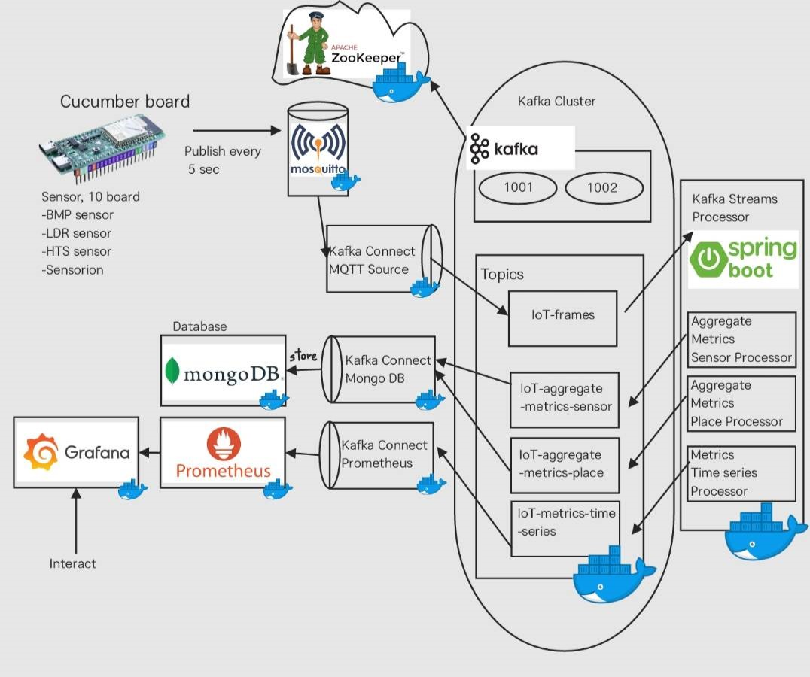

# Main technologies of architecture

## Architecture Overview

## Eclipse Mosquitto
Eclipse Mosquitto เป็นโครงการโอเพนซอร์สที่ให้บริการ MQTT Broker ซึ่งทำหน้าที่เป็นตัวกลางในการสื่อสารระหว่างอุปกรณ์ IoT และเครือข่ายอินเทอร์เน็ต โดย MQTT เป็นโปรโตคอลที่ออกแบบมาให้มีน้ำหนักเบาและมีประสิทธิภาพสูงสำหรับการสื่อสารของอุปกรณ์ที่มีข้อจำกัดด้านทรัพยากร ทั้งนี้ Mosquitto สามารถใช้งานได้กับอุปกรณ์หลากหลายประเภท โดยอุปกรณ์ที่เป็น Publisher จะส่งข้อมูลไปยัง Broker และอุปกรณ์ที่เป็น Subscriber จะดึงข้อมูลที่ต้องการจาก Broker

## Apache ZooKeeper
Apache ZooKeeper เป็นโซลูชันโอเพนซอร์สสำหรับการจัดการข้อมูลและการประสานงานในระบบคอมพิวเตอร์แบบกระจาย ZooKeeper ให้บริการการจัดเก็บและจัดการข้อมูลที่มีโครงสร้างในรูปแบบที่สามารถขยายได้ ใช้งานเพื่อช่วยลดความซับซ้อนในการประสานงานระหว่างเครื่องในระบบกระจายและช่วยให้แอปพลิเคชันที่ซับซ้อนสามารถทำงานร่วมกันได้อย่างราบรื่น

## Apache Kafka
Apache Kafka เป็นแพลตฟอร์มการสื่อสารข้อมูลแบบกระจายที่รองรับการเผยแพร่ จัดเก็บ และประมวลผลข้อมูลสตรีมในแบบเรียลไทม์ ถูกออกแบบมาเพื่อจัดการกับข้อมูลจำนวนมากจากแหล่งข้อมูลหลากหลาย พร้อมส่งต่อข้อมูลเหล่านั้นไปยังผู้ใช้งานต่าง ๆ ได้ในเวลาเดียวกัน Kafka เหมาะสำหรับระบบที่ต้องการรับส่งข้อมูลอย่างรวดเร็วและมีปริมาณข้อมูลมาก เช่น ระบบการวิเคราะห์ข้อมูลเชิงลึกแบบเรียลไทม์

## Apache Kafka Connect
Apache Kafka Connect เป็นส่วนขยายโอเพนซอร์สของ Apache Kafka ที่ช่วยให้สามารถเชื่อมต่อ Kafka กับระบบภายนอกได้อย่างง่ายดาย เช่น ฐานข้อมูล ระบบจัดเก็บ Key-Value และระบบไฟล์อื่น ๆ Kafka Connect ออกแบบมาเพื่อให้การสตรีมข้อมูลเข้าและออกจาก Kafka มีประสิทธิภาพสูงขึ้น พร้อมทั้งสนับสนุนการสร้างปลั๊กอินเชื่อมต่อที่มีความเสถียรและเชื่อถือได้ เป็นเครื่องมือสำคัญสำหรับการสร้าง ETL Pipeline เพื่อจัดการข้อมูล IoT และข้อมูลขนาดใหญ่ โดยรวมถึงการนำเข้าข้อมูล (Extract), การแปลงข้อมูล (Transform), และการโหลดข้อมูล (Load) เพื่อตอบสนองต่อการตรวจสอบและประมวลผลข้อมูลแบบเรียลไทม์ด้วยการใช้เทคโนโลยีอย่าง Apache Kafka, MongoDB, และ Prometheus

## Apache Kafka Streams
Apache Kafka Streams เป็นไลบรารีฝั่งไคลเอนต์สำหรับการพัฒนาแอปพลิเคชันและไมโครเซอร์วิสที่ประมวลผลข้อมูลจากสตรีมของ Apache Kafka ข้อมูลอินพุตและเอาต์พุตทั้งหมดถูกจัดเก็บในคลัสเตอร์ Kafka การใช้งาน Kafka Streams ทำให้การพัฒนาและปรับใช้แอปพลิเคชัน Java และ Scala สามารถทำได้ง่ายและรวดเร็ว ทั้งยังได้รับประโยชน์จากความสามารถในการทำงานแบบกระจายของคลัสเตอร์ Kafka เอง

## Prometheus
Prometheus เป็นเครื่องมือโอเพนซอร์สสำหรับการมอนิเตอร์และแจ้งเตือนเหตุการณ์ต่าง ๆ โดยการบันทึกข้อมูลตัววัดแบบเรียลไทม์ลงในฐานข้อมูลอนุกรมเวลา Prometheus ใช้โมเดลการดึงข้อมูลผ่าน HTTP และสนับสนุนการสืบค้นข้อมูลที่ยืดหยุ่น รวมถึงการตั้งค่าแจ้งเตือนเมื่อพบเหตุการณ์ที่ต้องการติดตาม

## MongoDB
MongoDB เป็นระบบฐานข้อมูล NoSQL แบบโอเพนซอร์สที่เน้นการจัดเก็บข้อมูลในรูปแบบเอกสาร แทนที่จะเก็บข้อมูลในรูปแบบตารางแบบฐานข้อมูลเชิงสัมพันธ์ MongoDB ใช้โครงสร้างข้อมูล BSON ที่ยืดหยุ่น ทำให้การจัดเก็บและดึงข้อมูลทำได้อย่างรวดเร็วและมีประสิทธิภาพ เหมาะสำหรับการใช้งานที่ต้องการความยืดหยุ่นสูง เช่น การจัดเก็บข้อมูลขนาดใหญ่ที่มีความเปลี่ยนแปลงบ่อย

## Grafana
Grafana เป็นซอฟต์แวร์โอเพนซอร์สสำหรับการสร้างและแสดงผลข้อมูลเมตริกโดยมีความสามารถในการเชื่อมต่อและดึงข้อมูลจากแหล่งข้อมูลหลายประเภท รวมถึงฐานข้อมูลอนุกรมเวลาอย่าง Prometheus, Graphite, และ InfluxDB Grafana ช่วยให้ผู้ใช้สามารถสร้างแดชบอร์ดและกราฟที่มีประสิทธิภาพ เพื่อตรวจสอบและติดตามสถานะระบบได้อย่างมีประสิทธิภาพ เดิมที Grafana พัฒนามาจาก Kibana แต่ต่อมาได้พัฒนาขึ้นเป็นซอฟต์แวร์อิสระ

## IoT-Sensor
IoT-Sensor เป็น Sensor ที่ได้จาก Local และ Cucumber โดยจะมีหน้าที่ส่งค่าที่เป็นอุณหภูมิ, ความชื้น, ความเข้มแสง โดยจะมีทั้งหมด 10 sensor 

